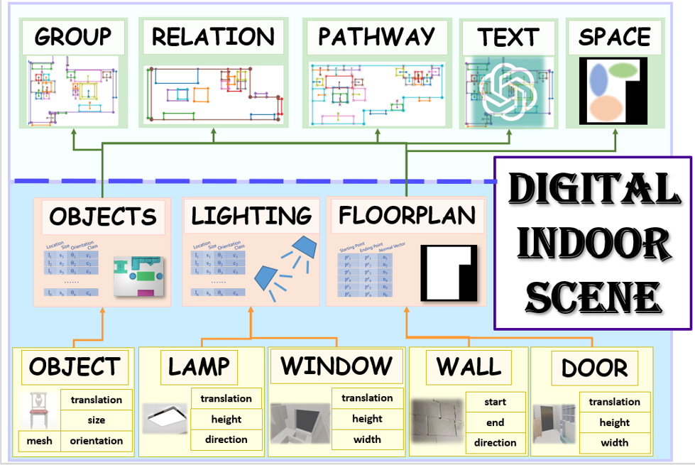
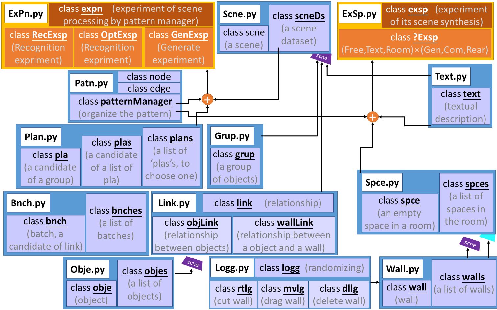

### Logic Structure

### Code Structure

### Terms
visualize: plot the statistics in a figure
draw: draw the result of the scene or the marks, where the objects are all in bounding boxes (mostly with matplotlib)
show: show the process of our algorithm with a video, where the objects are all in bounding boxes
render: the result scene, but we search meshes for each object (mostly with simple_3dviz)