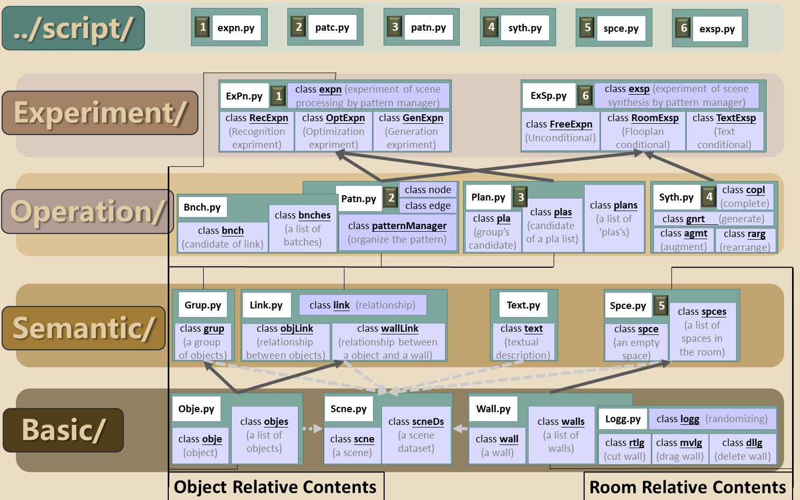

### About Us

       We are a group of students.

Mainly focusing on indoor scene synthesis and human-computer interacting.

### Logic Structure

### Code Structure

### Terms
visualize: plot the statistics in a figure
draw: draw the result of the scene or the marks, where the objects are all in bounding boxes (mostly with matplotlib)
show: show the process of our algorithm with a video, where the objects are all in bounding boxes
render: the result scene, but we search meshes for each object (mostly with simple_3dviz)

### Finally
感谢Logan。我本在一遍遍提醒自己不要陷入到漫无边际的噩梦之中，不要将“室内场景语义提取”作为核心的课题（记得在暑假的时候我以为这些只配在一个小中文期刊上投出），现在的奢望却越来越重。实际上，无论是具体的物体布局还是抽象的场景语义，只要是我们尝试以各种传统方法构建和处理，都逃脱不了其“古板”、“数据量小”、“空间封闭”的局限性，同时更不是一个顶会所青睐的话题。如果想要获得顶会的青睐或者让自己的课题更加有意义，无疑是需要跳出这个“传统方法”的框架（虽然可以保留对“场景语义”的概念的理解），去追求其他的课题，也就是我在1011号幻灯片中的立体直角坐标系中提到的内容。所以，我们的日程必须进一步提前，寒假结束前完成CEG，MM周期处理DFH，然后SA周期处理I，以及以后可能的各项问题。夏天能做完点事情吗？